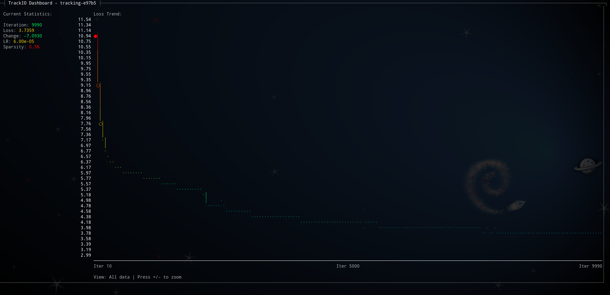
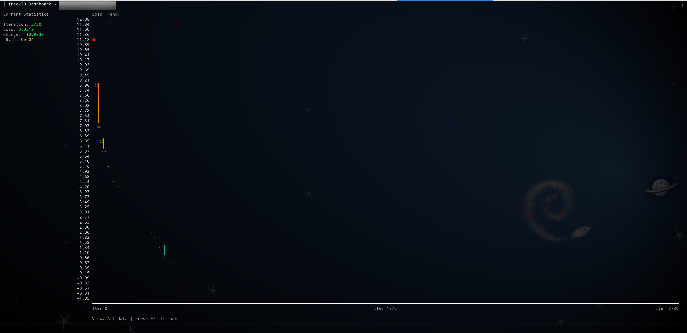
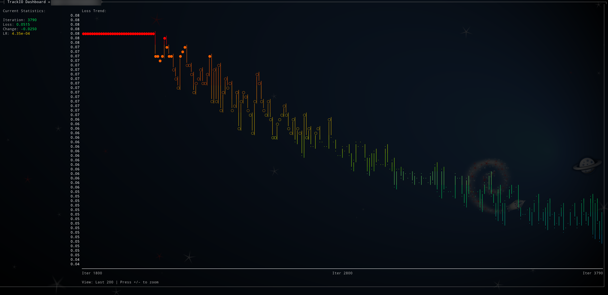
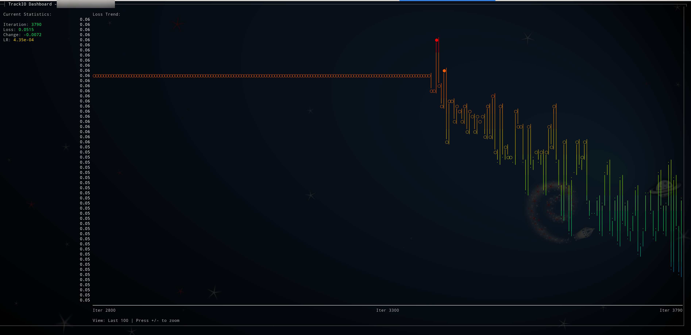
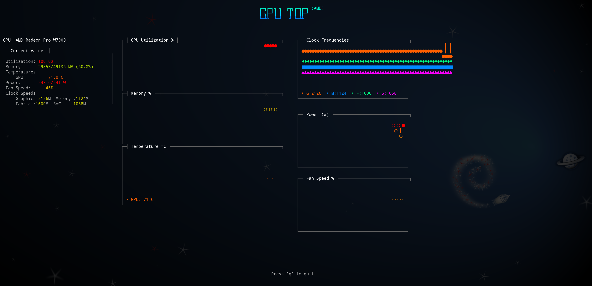

# TrackIO View

Terminal-based dashboard for [TrackIO](https://github.com/wandb/trackio) experiment tracking. Monitor your machine learning experiments directly from the command line with beautiful, real-time visualizations and GPU monitoring.



## Background

TrackIO View was originally developed as an enhancement to the main [TrackIO](https://github.com/wandb/trackio) project. Following feedback from the TrackIO maintainers who appreciated the functionality but felt it was out of scope for the core lightweight tracking library, this has been extracted into a standalone package:

> "This is very cool @mcgrof but is a bit out of scope and will be hard for us to maintain. Trackio is designed to be pretty lightweight and extensible so I'd recommend instead creating a separate trackio-view pypi package which we could link to from our documentation."

This allows TrackIO to remain focused on its core mission while providing users with a powerful, optional terminal-based monitoring tool. The original implementation can be found in the [TrackIO repository](https://github.com/wandb/trackio) on branch `20250921-trackio-view`.

## Features

- 📊 **Real-time Metrics Display**: Monitor training progress with live-updating terminal dashboard
- 📈 **ASCII Graphs**: Beautiful gradient-colored graphs for loss, accuracy, and custom metrics
- 🖥️ **GPU Monitoring**: Comprehensive GPU hardware monitoring (NVIDIA, AMD, Intel)
- 🔍 **Interactive Zoom**: Zoom in/out to examine different portions of training history
- 🎨 **Color-Coded Feedback**: Intuitive color gradients for quick performance assessment
- 🌐 **Remote-Friendly**: Perfect for monitoring training on remote servers via SSH
- ⚡ **Lightweight**: Minimal resource usage compared to web dashboards
- 🔧 **Flexible**: Works with or without the `rich` library for enhanced visuals

## Installation

```bash
pip install trackio-view
```

For enhanced terminal graphics (recommended):

```bash
pip install trackio-view[rich]
```

For NVIDIA GPU monitoring support:

```bash
pip install trackio-view[nvidia]
```

Install all optional dependencies:

```bash
pip install trackio-view[all]
```

## Quick Start

### Monitor Training Metrics

Start your training with TrackIO:

```python
import trackio

trackio.init(project="my-experiment")

for epoch in range(num_epochs):
    for batch in dataloader:
        loss = train_step(batch)
        trackio.log({"loss": loss, "epoch": epoch})

trackio.finish()
```

In another terminal, launch the dashboard:

```bash
trackio-view --project my-experiment
```

### Monitor GPU Hardware

```bash
# Real-time GPU monitoring
trackio-view --gpu

# Quick GPU status check
trackio-view --gpu --once
```

### View Logged GPU Metrics

If you logged GPU metrics during training:

```python
trackio.init(project="my-training", log_gpu=True)
```

View them later:

```bash
# Display GPU database metrics once
trackio-view --gpu-db --project my-training --once

# Live monitoring of GPU database
trackio-view --gpu-db --project my-training
```

## Usage

### Command Line Options

```
trackio-view [OPTIONS]

Options:
  -p, --project TEXT     Project name to monitor
  -i, --interval INT     Update interval in seconds (default: 2)
  --once                 Display once and exit (no live monitoring)
  --gpu                  Show live GPU hardware metrics
  --gpu-db               Show GPU metrics from database (requires --project)
  -z, --zoom {0,1,2,3,4} Initial zoom level (0=all, 1=500, 2=200, 3=100, 4=50)
  -h, --help            Show help message
```

### Interactive Controls (Live Mode)

- **Press `+`**: Zoom in (show fewer, more recent iterations)
- **Press `-`**: Zoom out (show more training history)
- **Press `q`**: Quit
- **Number keys (0-9)**: Switch between GPUs (in GPU mode)

#### Zoom Visualization

The interactive zoom feature lets you explore different time scales of your training. Press `+` to zoom in (see fewer, more recent iterations) and `-` to zoom out (see more history).

**Real-World Example: Progressive Zoom Levels**

Each level numerically represents zooming in by pressing `+`:

**Level 1 - Initial View (500 iterations):**



**Level 2 - Zoomed In (200 iterations):**



**Level 3 - Maximum Detail (100 iterations):**



This feature is perfect for:
- Getting an overview of entire training runs (zoom out)
- Examining recent training dynamics in detail (zoom in)
- Identifying patterns at different time scales
- Monitoring convergence behavior and spotting anomalies

### Examples

```bash
# Monitor specific project
trackio-view --project my-model-training

# Quick snapshot without live updates
trackio-view --once

# Start with zoom on last 200 iterations
trackio-view --zoom 2

# Slower updates (every 5 seconds)
trackio-view --interval 5

# Monitor GPU while training
trackio-view --gpu

# View historical GPU data from training
trackio-view --gpu-db --project my-training --once
```

## GPU Monitoring

TrackIO View includes comprehensive GPU monitoring inspired by [gputop](https://github.com/mcgrof/gputop).



### Supported GPUs

#### NVIDIA GPUs
- Desktop: RTX 30/40 series, GTX 10/16 series, Quadro
- Datacenter: A100, V100, A10G, T4
- Embedded: Jetson TX2, Xavier, Orin, Nano

#### AMD GPUs
- Workstation: Radeon Pro W7900, W6800, W5700
- Consumer: RX 6000/7000 series, RX 500/Vega series
- Datacenter: MI100, MI250, MI300 series

#### Intel GPUs
- Arc series discrete GPUs
- Integrated: Iris Xe, UHD Graphics

### GPU Metrics

- GPU utilization percentage
- Memory usage (GB and percentage)
- Temperature (multiple sensors)
- Power consumption
- Clock frequencies (graphics, memory, fabric, SoC)
- Fan speed and RPM
- Performance states

## Use Cases

### Remote Training Monitoring

```bash
# SSH into remote server
ssh user@gpu-server

# Monitor training progress
trackio-view --project remote-training

# Or run in screen/tmux for persistent monitoring
screen -S training-monitor
trackio-view --project my-training
```

### Quick Status Checks

```bash
# Get training snapshot
trackio-view --once

# Pipe to file
trackio-view --once > metrics.txt

# Extract specific metrics
trackio-view --once | grep "Latest Loss:"
```

### Automation and Scripting

```bash
# Check if training converged
change=$(trackio-view --once --zoom 3 | grep "Loss Change:" | awk '{print $3}')
if (( $(echo "$change < 0.001 && $change > -0.001" | bc -l) )); then
  echo "Training has converged"
fi

# Log progress periodically
while true; do
  trackio-view --once >> training_log.txt
  sleep 3600
done
```

## Architecture

TrackIO View is designed as a lightweight, standalone package that depends on TrackIO for data access:

- **trackio_view.view**: Main viewer module with terminal UI
- **trackio_view.gpu_monitor**: Cross-platform GPU monitoring backend
- **trackio_view.gpu_dashboard**: Simplified GPU dashboard
- **trackio_view.gpu_dashboard_gputop**: Full gputop-style monitoring

The package uses:
- ANSI escape codes for terminal control and colors
- Gradient color schemes for visual feedback
- Deque-based data structures for efficient graph rendering
- Platform-specific GPU interfaces (NVML, sysfs, DRM)

## Requirements

- Python 3.8+
- trackio >= 0.1.0
- Optional: `rich` for enhanced terminal graphics
- Optional: `nvidia-ml-py` for NVIDIA GPU monitoring

## Development

```bash
# Clone the repository
git clone https://github.com/mcgrof/trackio-view.git
cd trackio-view

# Install in development mode
pip install -e .[dev]

# Run tests
pytest

# Format code
ruff check --fix --select I && ruff format
```

## Troubleshooting

### No data found

Ensure:
- TrackIO logging is enabled in your training script
- Data is in the expected location (`~/.cache/huggingface/trackio/`)
- Correct project name is specified

### Colors not displaying

Try:
- Using a modern terminal (iTerm2, Windows Terminal, etc.)
- Setting `TERM=xterm-256color`
- Installing the `rich` library

### GPU monitoring not working

Check:
- GPU drivers are installed
- For NVIDIA: Install `nvidia-ml-py` package
- For AMD: sysfs hwmon interfaces are accessible
- Run with `--once` to see detailed error messages

## Contributing

Contributions are welcome! Please feel free to submit a Pull Request.

## License

MIT - See LICENSE file for details

## Credits

- Inspired by [gputop](https://github.com/mcgrof/gputop) for terminal-based GPU monitoring
- Built on top of [TrackIO](https://github.com/wandb/trackio) for experiment tracking

## Links

- [TrackIO Documentation](https://docs.claude.com/trackio)
- [TrackIO GitHub](https://github.com/wandb/trackio)
- [Issue Tracker](https://github.com/wandb/trackio/issues)
